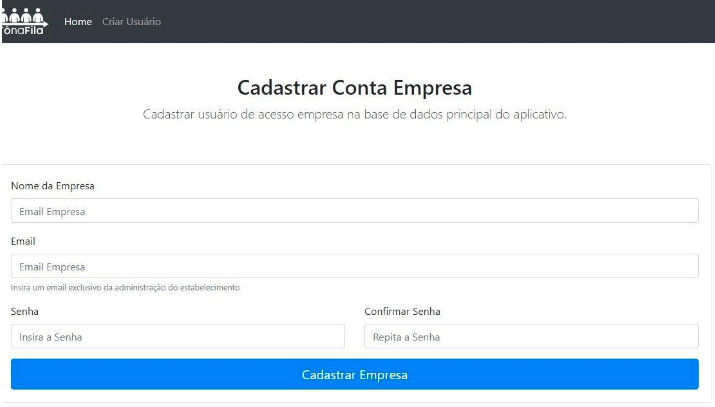

### Aplicativo para gestão de filas de restaurantes.

Este projeto tem como objetivo o planejamento e o desenvolvimento de uma aplicação mobile para sistema operacional Android, que gerencie e controle as filas de estabelecimentos como restaurantes e bares.
#### Descrição
Com o avanço da tecnologia, e a globalização de informações causadas pela internet, estamos cada vez mais com um pensamento e tendências imediatistas, hoje tem-se mais acesso a informações e notícias em tempo real. Com isso, temos menos tempo livre para realizar nossas tarefas do cotidiano, perder tempo com coisas simples, como uma fila, acaba se tornando algo inviável para muitas pessoas.
Pensando nisso, ter a informação sobre um determinado estabelecimento, se existe fila ou não, se torna algo muito útil, possibilitando um melhor planejamento, como sair mais cedo de casa, ou deixar para ir nesse local em outro momento.
Ainda é possível ir além, como por exemplo, entrar nessa fila de forma remota ainda a caminho do local, são facilidades que qualquer cliente gostaria de usufruir. Otimizar o seu tempo para poder fazer outras coisas enquanto aguarda, além de diminuir o tempo de espera entrando na fila de forma remota. Sem falar na facilidade de gerenciar a fila por parte do estabelecimento, podendo avisar seus clientes que é a vez dele através de notificações no próprio aplicativo.
Pensando em todas essas facilidades, o desenvolvimento de um aplicativo que gerencie tudo isso de forma fácil e intuitiva se torna viável, pois irá facilitar tanto para os clientes quanto para os estabelecimentos comerciais.

#### Aplicação Cliente
###### Aplicação do cliente para cadastro e agendamento nos estabelecimentos:

#### Aplicação Estabelecimento

###### Aplicação do estabelecimento para cadastro de filas e recepção de clientes:

#### Gerencimento de Estabelecimentos

###### Sistema Web de cadastro de estabelecimentos:

